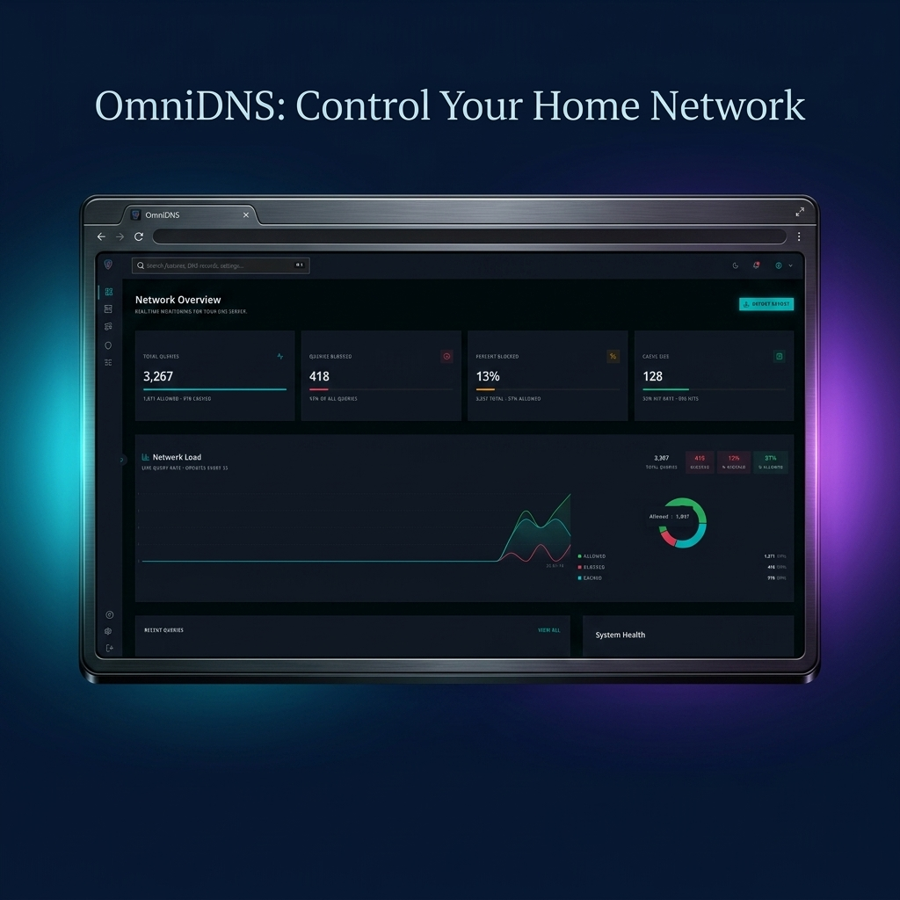
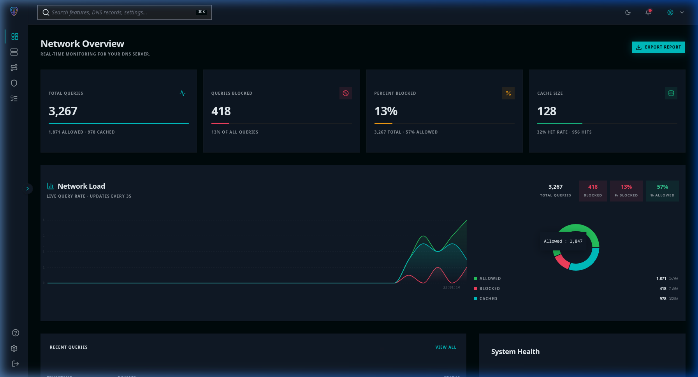
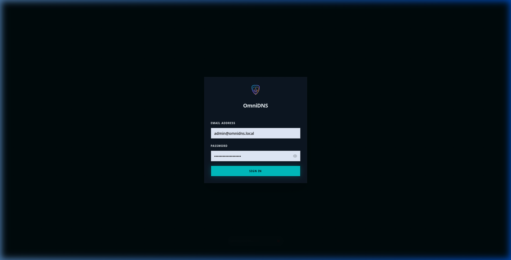

# 📸 OmniDNS Interface Screenshots

Here are the interface screenshots for OmniDNS in dark mode, showing the self-hosted DNS manager in action.

---

## 🎨 Professional Product Mockup
A high-fidelity presentation mockup of the OmniDNS dashboard with active query logging and live traffic lines:

---

## 📊 Main Dashboard (Dark Mode)
The primary overview screen displaying system queries (allowed, blocked, cached), active cache status, live traffic load metrics, and real-time query logs:

---

## 🔒 Security Login Page
The secure portal for system administrators:

